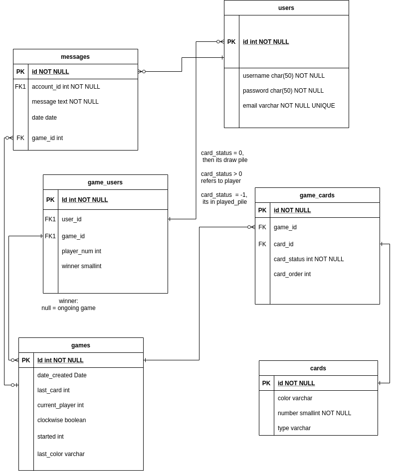

# Documentation for Uno Project
## 
 Team D 

#### *Alex Pena, Tahar Touati, Chris Riddle, Peter Hu*

## Starting the server

To run the server locally, use the command `npm run start:dev`
The server listens on port 3000. We cannot use the `npm run` 
command locally as it will break. This 
script is reserved for use by Heroku.

### Migrations

To run the migrations, run the command:

`npx sequelize db:migrate`

To undo all the migrations run

`npx sequelize db:migrate:undo:all`

The migrations will create several tables in the database

### Database Structure

### Requirements

| Category     | Requirement                               | Completed
| -----------  | -----------                               | ---------
| Registration | Users can create an account               | X
|              | One account can be created with one email | X
|              | Passwords are hashed                      | X
| Login        | Registered users can login
|              | Login requires hashed passwords           | X
| Lobby        | Title                                     |
| Chat         | Text                                      |

