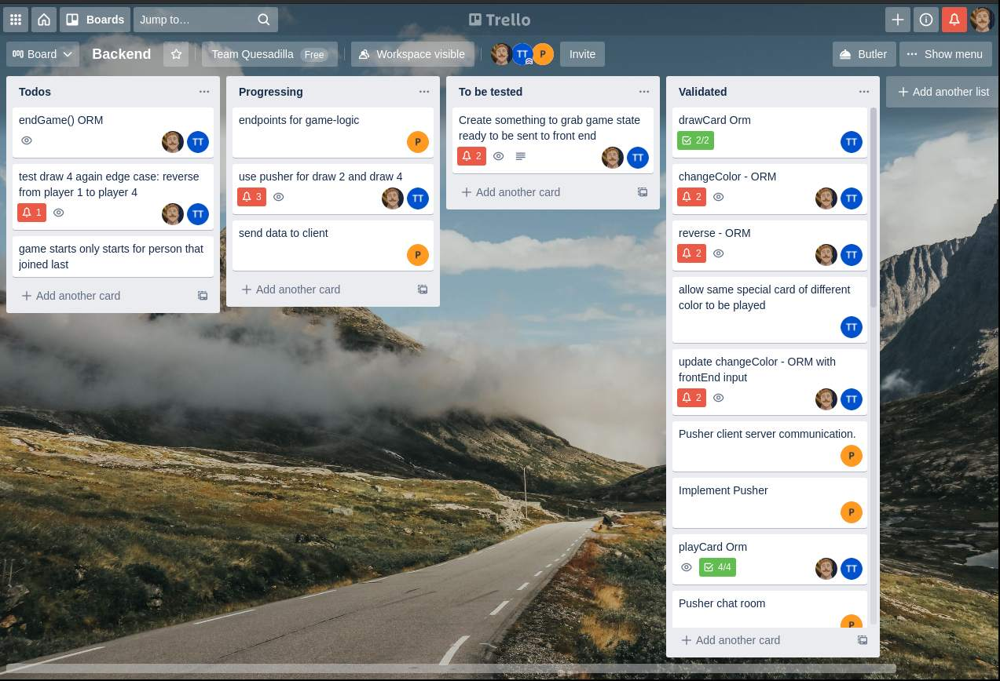

<center>

##  Uno Project 
#### Team D 
#### *Alex Pena, Tahar Touati, Chris Riddle, Peter Hu*

Heroku link: https://fast-beyond-10302.herokuapp.com/

</center>


## Table of Contents

1. [Overview](#overview)

2. [Technology Stack](#technology-stack)

3. [Starting the development server](#starting-the-development-server)

4. [Migrations](#migrations)

5. [Database Structure](#database-structure)

6. [Deploying to Heroku](#deploying-to-heroku)

7. [Requirements](#requirements)

8. [Challenges](#challenges)


## Overview
This was a group effort to recreate the game of Uno in real-time multiplayer
online. Our web app allows users to register and create and join multiple games.
A user can join many games and play multiple games concurrently. We store the 
game state in the database which allows users to join, leave and resume games 
without losing the state of the game. The game requires four players and starts 
automatically when the fourth player joins the game.

## Technology Stack
- Database: Postgres
- Database Migrations: Sequelize
- Web Server: Node.js
- Web Framework: Express
- Front End: Vanilla javascript and CSS
- Sockets: Pusher.js

## Starting the development server

First run `npm install`,

Then before starting the development server, you must create a .env file in the root 
with the following fields:

```
DATABASE_URL=postgres://user@localhost:5432/uno
SESSION_SECRET=secret
```
Where the DATABASE\_URL gives the postgres credentials that allow sequelize and
pg-promise to access the database. The SESSION\_SECRET is a passphrase 
required for passport to use the sessions securely.

To run the server locally, use the command `npm run start:dev`
The server listens on port 3000. We cannot use the `npm run` 
command locally as it will break. This 
script is reserved for use by Heroku.

## Migrations

To run the server, first you need to run the migrations to create the tables
in the database. To run the migrations, run the command:

`npx sequelize db:migrate`

To undo all the migrations run

`npx sequelize db:migrate:undo:all`

The migrations will create several tables in the database

## Deploying to Heroku

To deploy to Heroku, first install the heroku-cli and login. Then after selecting 
your heroku project in the command line run:

`git push heroku your-local-branch:main`

Heroku then runs the sequelize migrations automatically, but sometimes you 
need to undo the migrations and rerun them. In that case you need to run:

`heroku run sequelize db:migrate:undo:all`

then

`heroku run sequelize db:migrate`

## Database Structure


## Requirements

| Category     | Requirement                                                        | Completed
| -----------  | -----------                                                        | ---------
| Registration | Users can create an account                                        | X
|               | One account can be created with one email                          | X
|              | Passwords are hashed                                               | X
| Login        | Registered users can login                                         | X
|              | Login requires email and hashed password                           | X
| Lobby        | Users can create a game                                            | X
|              | Users can join a game                                              | X
|              | Users can resume a game                                            | X
|              | Pusher handles game list in real time                              | X
| Game Lobby   | Users see number of players in game lobby                          | X
|              | Users can leave game                                               | X
|              | Users can go back to the lobby                                     | X
|              | Users are updated on who joins or leaves the game lobby            | X
|              | game starts automatically for everybody when fourth player joins   | X
| Chat         | Users can chat globally in the lobby                               | X
|              | Users can chat privately within the game lobby and game to players | X
| Game Logic   | Player can draw a card on their turn                               | X
|              | Player can play a card if it is valid and their turn               | X
|              | Implemented special card effects eg. Draw 2, skip, reverse         | X
|              | Game ends when a player has zero cards                             | X

## Challenges
##### Non-Technical Challenges
*Colloborating efficiently*: What was challenging for us was figuring out 
how to collaborate and split up work between the team. We had to learn each 
others technical background and also coordinate depending on how each team member 
wanted to contribute to the project. This was challenging because nobody on the team
was an expert on creating a web server using this technology stack.

*Communication (Trello)*: To coordinate tasks we used Trello. Trello helped us 
overcome task distribution so that our team members were aware of what other team 
members were contributing and also prevent two team members from incorrectly working
on the same feature.



##### Technical Challenges

*Github:* Each team member was required to utitilize branching
and pull requests to reduce merge conflicts.

*Migrations On Heroku*

*using socketio then using pusher*

*implementing change color card*

*rendering pages dynamically for everyone*
